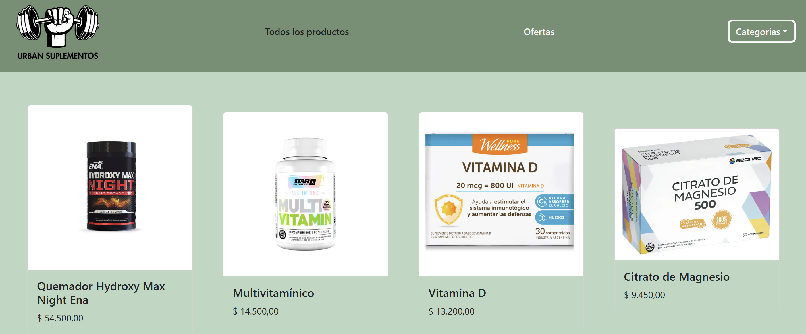

# Curso React

Este repositorio contiene un proyecto de E-commerce de Suplementos realizado para un curso de CoderHouse.



## Instalación

1. Clonar el repositorio
```bash
git clone https://github.com/natiortu/react-coderhouse.git
```

2. Moverse a la carpeta del proyecto e instalar dependencias
```bash
cd react
npm install
```

3. Correr la app en servidor local
```bash
npm run dev
```
